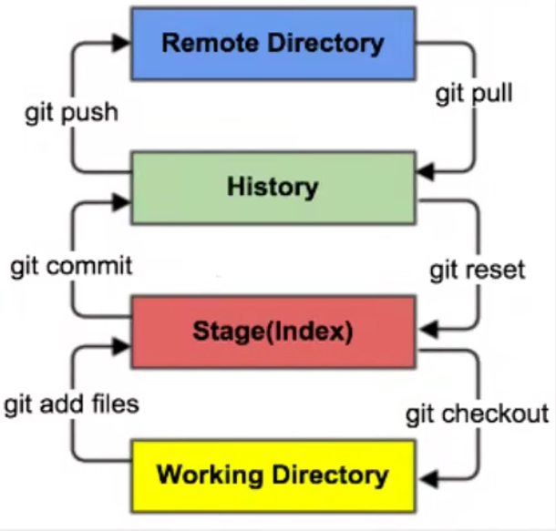
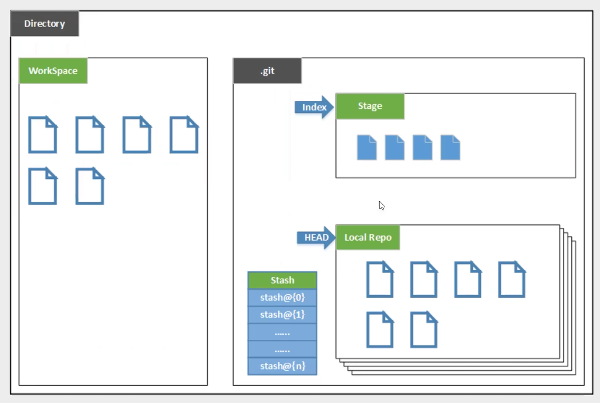
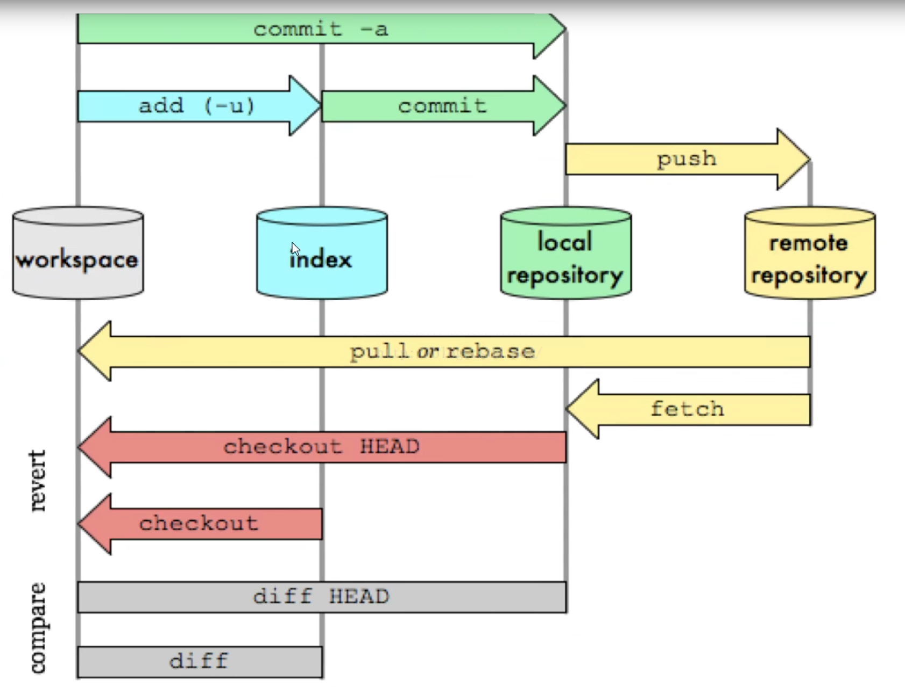
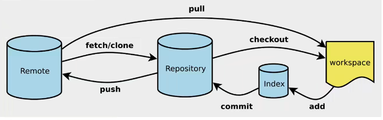

<!--more-->
## 基本的Linux命令
- `cd` 改变目录
- `pwd` 显示当前所在的目录路径
- `ls` 列出当前目录的所有文件
- `touch` 新建文件，比如：touch index.js
- `rm` 删除文件, `rm -r`删除一个文件夹
- `mkdir` 新建一个目录
- `mv` 移动
- `clear` 清屏
- `history` 查看命令历史
- `help` 帮助
- `exit` 退出

## git的常用命令
- `git commit` 
- ``


## git的安装

## git的环境配置
### 查看git的配置
1. 查看当前用户（global）配置 
```
git config --global --list

```
2. 查看系统config
```
git config --system --list
```
其实就是读.gitconfig文件

###  配置git的用户名和邮箱（必须）
1. 配置用户名
```
git config --global user.name "jam"
```

2. 配置邮箱
```
git config --global user.email "jamis404@163.com"
```
其实就是写.gitconfig文件


## git的基本理论
### 工作区域
Git有四个工作区域。
- 本地：工作目录（Working Directory）
- 本地：暂存区（Stage/Index）
- 本地：资源库（Repository或者Git Directory）。
- 远程：git仓库（Remote Directory



### 基本概念
- Workspace：工作区，就是你平时存放项目代码的地方
- Stage/Index：暂存区，用于临时存放你的改动，事实上它只是一个文件，保存即将提交到文件列表信息。
- Repository：仓库区（或本地仓库），就是安全存放数据的位置，这里面有你提交到所有版本的数据。其中HEAD指向最新放入仓库的版本。
- Remote：远程仓库，托管代码的服务器

 

### 工作流程
git的工作流程一般是这样的：
1. 在工作目录中添加、修改文件；
2. 将需要进行版本管理的文件放入暂存区域；
3. 将暂存区域的文件提交到git仓库。

因此，git管理的文件有三种状态：已修改（modified），已暂存（staged），已提交（committed）。

 


日常使用只需要记住以下6个命令：
 

 ## git项目搭建

 ### 本地仓库创建并且关联远程仓库
 ```
echo "# git-test" >> README.md
git init
git add README.md
git commit -m "first commit"
git branch -M main
git remote add origin git@github.com:jamloveu/git-test.git
git push -u origin main
 ```

 ### 远程仓库
 ```
git remote add origin git@github.com:jamloveu/git-test.git
git branch -M main
git push -u origin main
 ```        