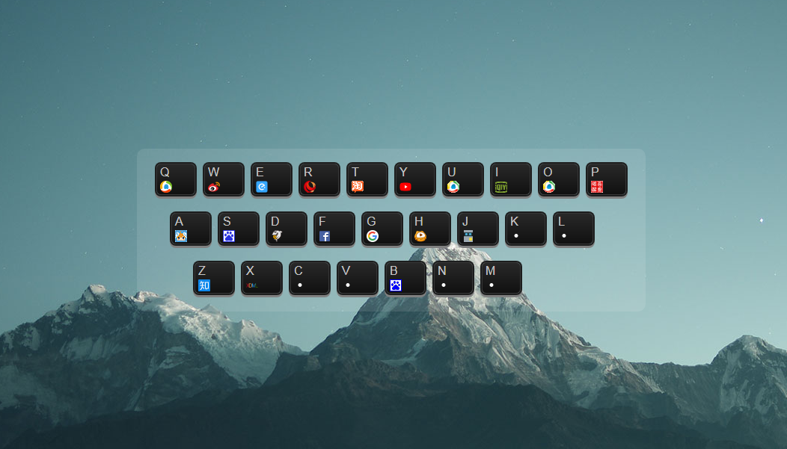

<!--more-->

# 预览：


要实现的功能

1. 在用户按下键时在新窗口打开相应的网站
2. 对应网站的logo显示在按键上
3. 按键可以自定义，且可以保存（鼠标悬浮在键盘上出现编辑，点击后弹出编辑框，并且可以保存）

## 1，首先要声明两个hash,用来存按键（qwer。。。）和按键对应的网址（q: qq.com;）
```
    var hashA = init()
    var keys = hashA["keys"]
    var hash = hashA["hash"]

    function init() {
      var keys = {
        0: ["q", "w", "e", "r", "t", "y", "u", "i", "o", "p"],
        1: ["a", "s", "d", "f", "g", "h", "j", "k", "l"],
        2: ["z", "x", "c", "v", "b", "n", "m"],
        length: 3
      }
      var hash = {
        q: 'mail.qq.com', w: 'weibo.com', e: undefined,
        r: 'www.people.com.cn', t: 'taobao.com',
        y: 'www.youtube.com', u: undefined,
        i: 'iqiyi.com', o: undefined,
        p: '52pojie.cn', a: 'acfun.tv',
        s: 'souhu.com', d: 'douyu.com',
        f: 'www.facebook.com', g: 'github.com',
        h: 'huya.com', j: 'js.jirengu.com',
        k: undefined, l: undefined, z: 'www.zhihu.com',
        x: 'xiedaimala.com', c: undefined, v: undefined,
        b: 'baidu.com', n: undefined, m: undefined
    }
```
## 2，遍历keys，生成kbd标签（生标签加class）
```
        generateKeybord(keys, hash)

        function tag(tagName) {
        return document.createElement(tagName)
        }

        function createSpan(textContent) {
        var span = tag('span')
        span.textContent = textContent
        span.className = "text"
        return span
        }

        function generateKeybord(keys, hash) {
        for (var index = 0; index < keys['length']; index = index + 1) {
            var div = tag('div')
            div.className = 'row'

            main.appendChild(div)

            var row = keys[index] // 第一个数组,第二个数组,第三个数组
            for (var index2 = 0; index2 < row['length']; index2 = index2 + 1) {
            var span = createSpan(row[index2])

            var button = creatButton(row[index2])

            var img = creatImage(hash[row[index2]])

            var kbd = tag('kbd')
            kbd.className = 'key'

            kbd.appendChild(span)
            kbd.appendChild(img)
            kbd.appendChild(button)

            div.appendChild(kbd)
            }
        }
        }
```


## 3，监听用户动作（监听到用户按了哪个键，然后在新标签页打开）
```
        ListenToUser(hash)

        function ListenToUser(hash) {
            document.onkeypress = function (xzkjcnxlkcjlk) {
                var key = xzkjcnxlkcjlk['key'] //q w e r...
                var website = hash[key]
                //location.href = 'http://'+website
                window.open('http://' + website, '_blank')
            }
        }
```

## 4，加其他功能，可编辑保存，按键上显示对应网址的图标
```
    function creatButton(id) {
      var button = tag('button')
      button.textContent = '编辑'
      button.id = id
      button.onclick = function (xzkjcnxlkcjlk) {
        var button2 = xzkjcnxlkcjlk['target']
        var img2 = button2.previousSibling
        var key = button2['id']
        var x = prompt('给我一个网址')
        hash[key] = x //hash变更
        img2.src = 'http://' + x + '/favicon.ico'
        img2.onerror = function (xxx) {
          xxx.target.src = ('./blank.png')
        }
        localStorage.setItem('zzz', JSON.stringify(hash)) //把变更后的hash存在zzz里面
      }
      return button
    }
    
    function creatImage(domain) {
      var img = tag('img')
      if (domain) {
        img.src = 'http://' + domain + '/favicon.ico'
      } else {
        img.src = './blank.png'
      }
      img.onerror = function (xxx) {
        xxx.target.src = ('./blank.png')
      }
      return img
    }
```
然后再加上自己喜欢的CSS样式，一个只属于自己导航就完成了~~~